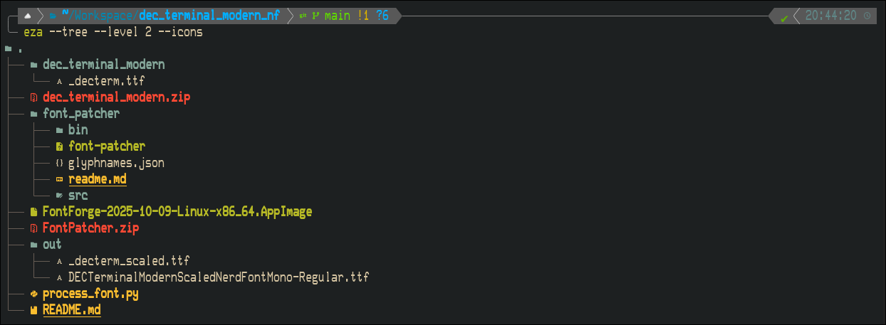

# DEC Terminal Modern Nerd Font

Vintage font from Digital Electronics Corp (DEC) VT220 terminals for your terminal emulator. 
Now patched to include [Nerd Fonts](https://github.com/ryanoasis/nerd-fonts).

This repo contains a patch for [DEC Terminal Modern](https://www.dafont.com/dec-terminal-modern.font). It adds Nerd Fonts glyphs
and width adjustments. I can't find the author but huge thanks for whoever uploaded published this!

When using this font however, it appears too thin for my eyes. And looking at the wonderful blog post [Raster CRT Typography (According to DEC)](https://www.masswerk.at/nowgobang/2019/dec-crt-typography), I did a very scientific test by checking the pixel differnences in phtopea to stretch the font by 9%. Now its nice.




You can find the standard and stretched version in the [releases](releases/latest).


## Requirements

- The [DEC Terminal Modern](https://www.dafont.com/dec-terminal-modern.font) ttf font file
- font-patcher from the [nerd-fonts](https://github.com/ryanoasis/nerd-fonts#font-patcher) repo
  - Will also provide instructions for running fontforge

## Steps

1. **Scale font width by 9%** and rename to *DEC Terminal Modern Scaled*:
   ```sh
   ./FontForge-2025-10-09-Linux-x86_64.AppImage \
     -script $PWD/process_font.py \
     $PWD/dec_terminal_modern/_decterm.ttf \
     $PWD/out/_decterm_scaled.ttf \
     1.09
   ```

2. **Run Nerd Fonts patcher** with complete + monospace glyph set:
   ```sh
   ./FontForge-2025-10-09-Linux-x86_64.AppImage \
     -script $PWD/font_patcher/font-patcher \
     --complete --mono \
     --outputdir $PWD/out \
     --extension ttf \
     $PWD/out/_decterm_scaled.ttf
   ```

## Output

`DECTerminalModernScaledNerdFontMono-Regular.ttf` to be used anywhere you wish.

## CLI Reference — `process_font.py`

```shell
fontforge -script process_font.py <input.ttf> <output.ttf> <scale_factor>
```

Scaled font width by `scale_factor` (e.g. `1.09` for 9% wider) and renames the font family to *DEC Terminal Modern Scaled*.

